# Insight Coach
Insight Coach is an Android app I created as an intern at the Insight Centre for Data Analytics in UCD. The app was used and liked by people with diabetes who participated in an exercise program for a research study. Here's a [paper](https://hdl.handle.net/10197/10371) detailing the study.

Insight Coach implements an adaptive coaching system for use in an exercise program for sedentary individuals. The app allows users to record their exercise activity. Every week the user progresses to the next level of the exercise program if they have completed enough prescribed exercise sessions at the current level. This is accompanied by a notification which either congratulates the user for their progress or encourages them if they have not progressed. The app also schedules and sends notifications and reminders about the user's prescribed exercise sessions. These notifications are sent at the same times of day regardless of timezone changes or transitions in and out of daylight saving time.

I used the [TimesSquare Android widget](https://github.com/square/android-times-square) for picking a single date from a calendar view.

Note: RPE stands for Rating of Perceived Exertion

### Screenshots

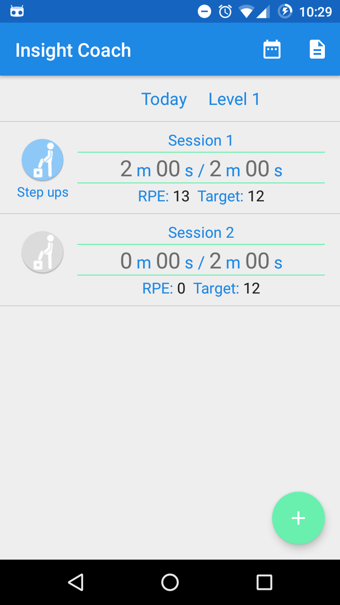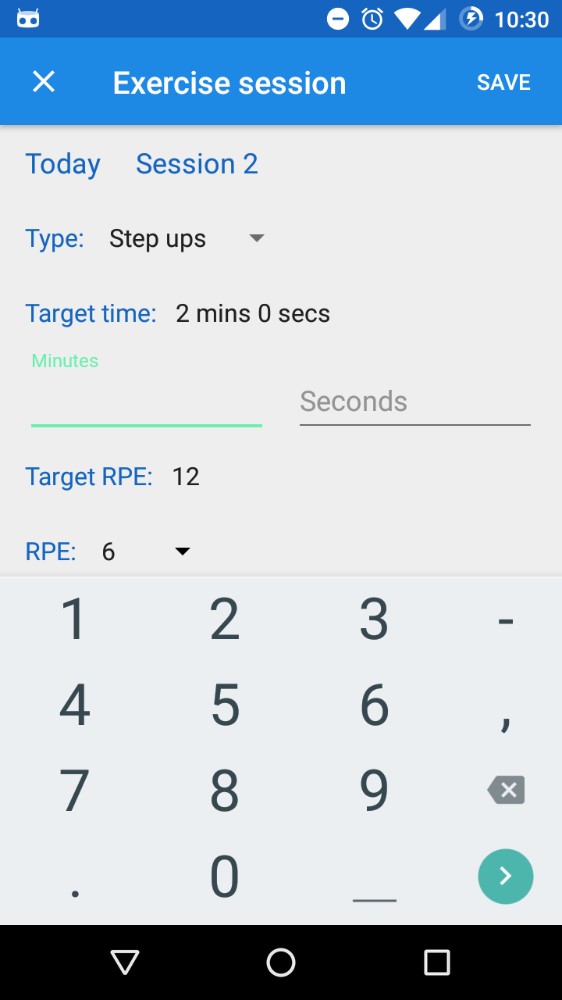
   
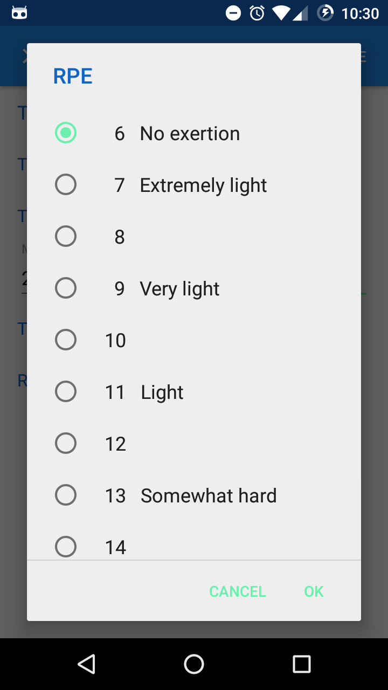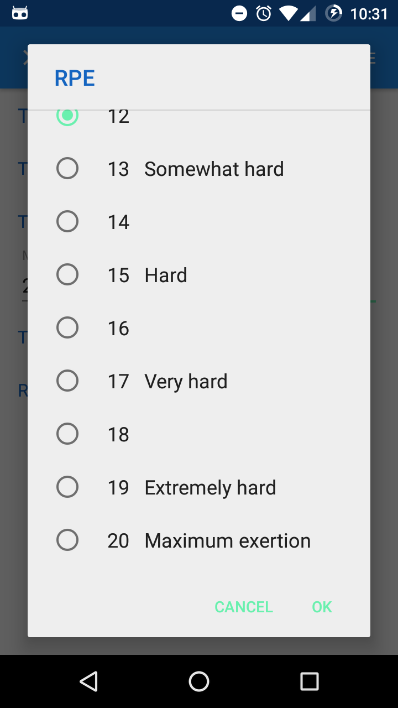
   
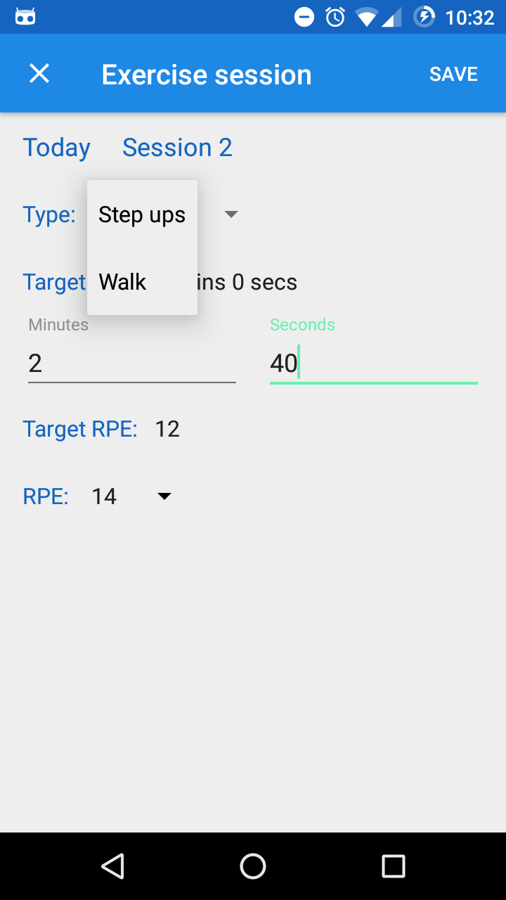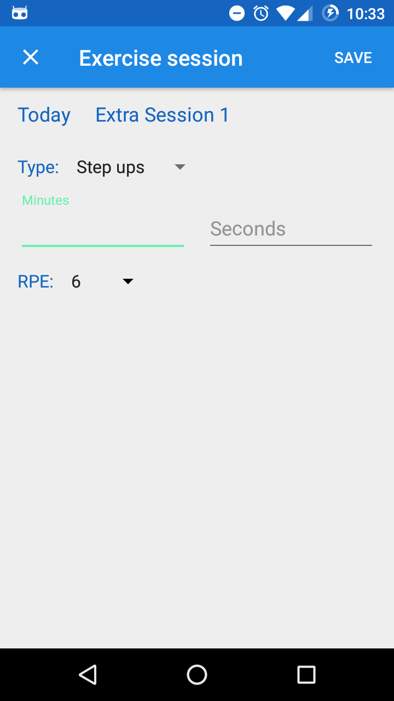
   
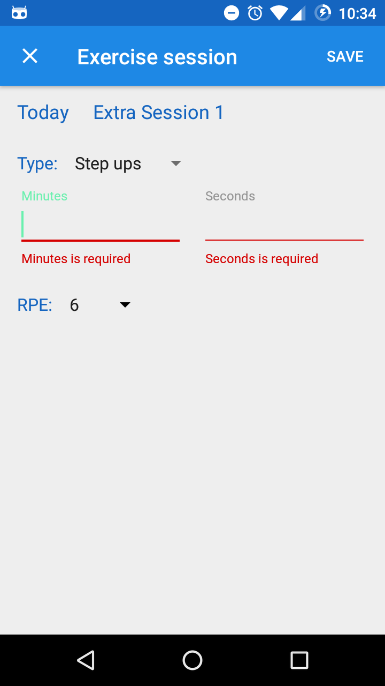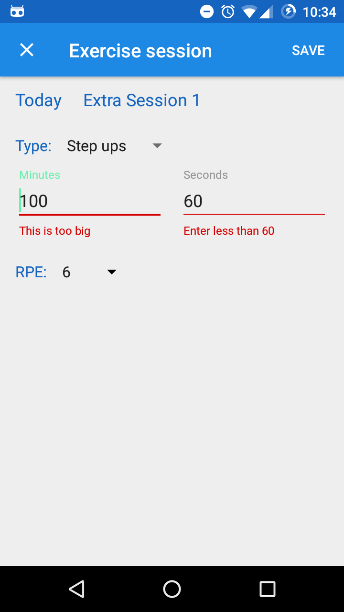
   
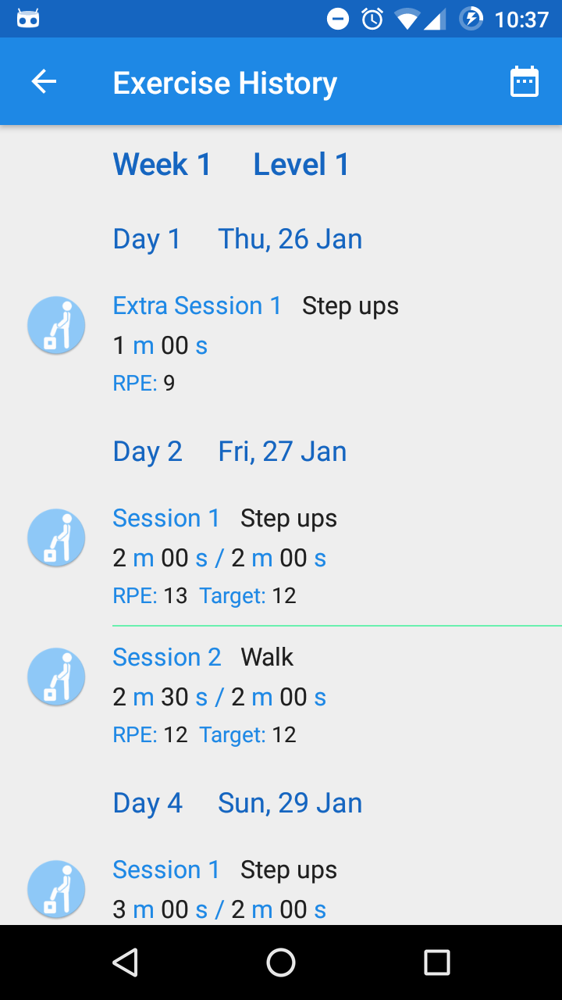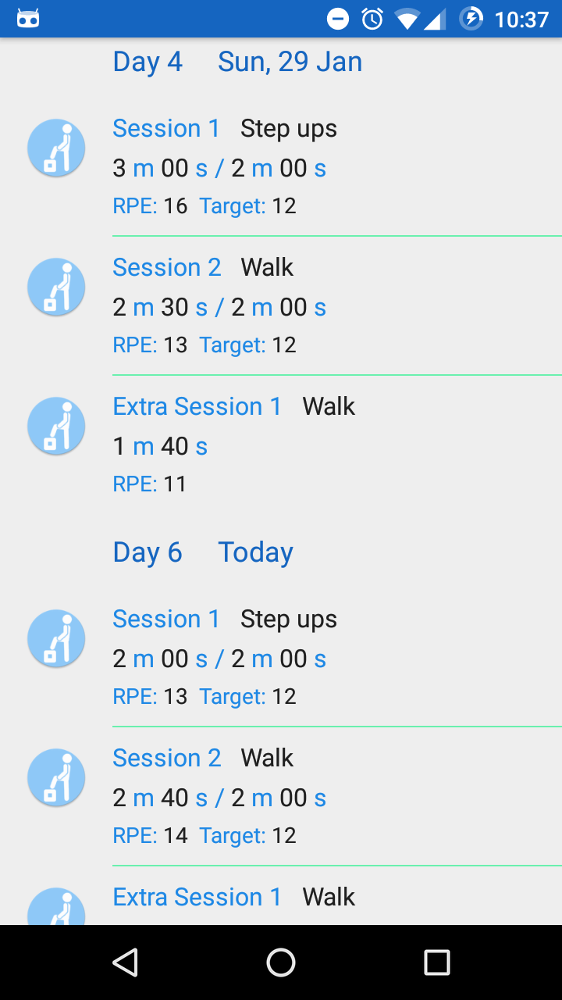
   
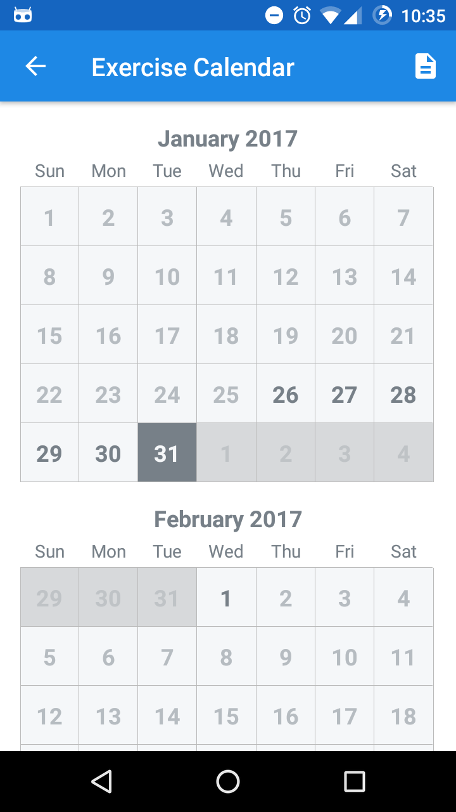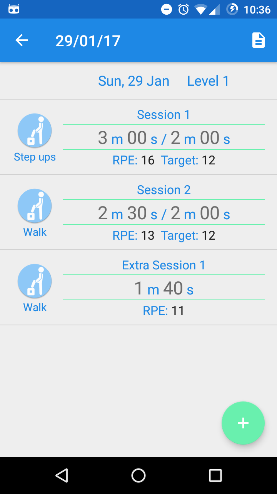
   
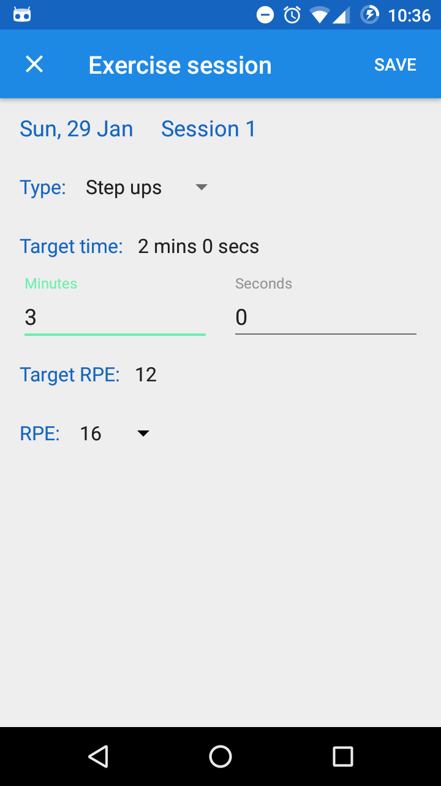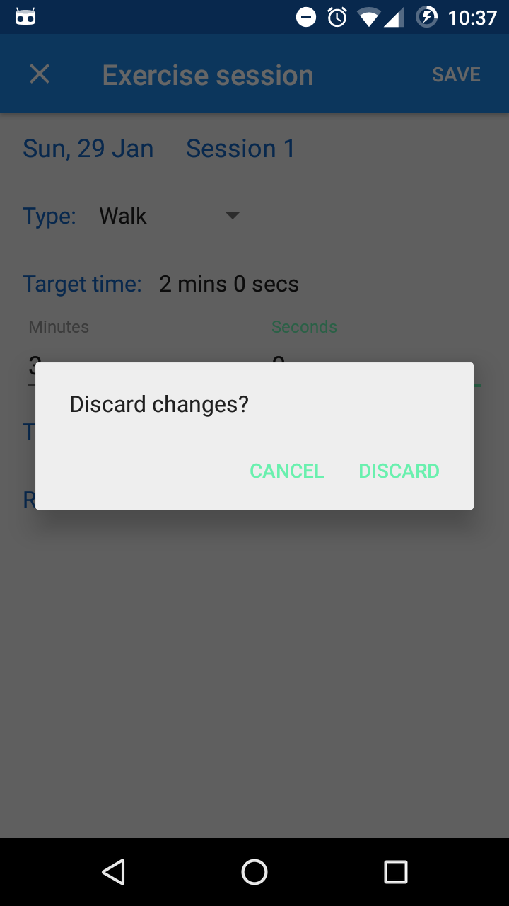
   
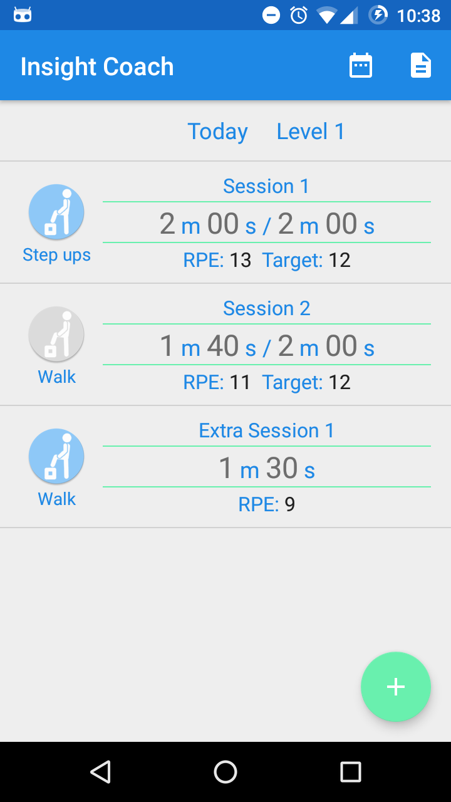
